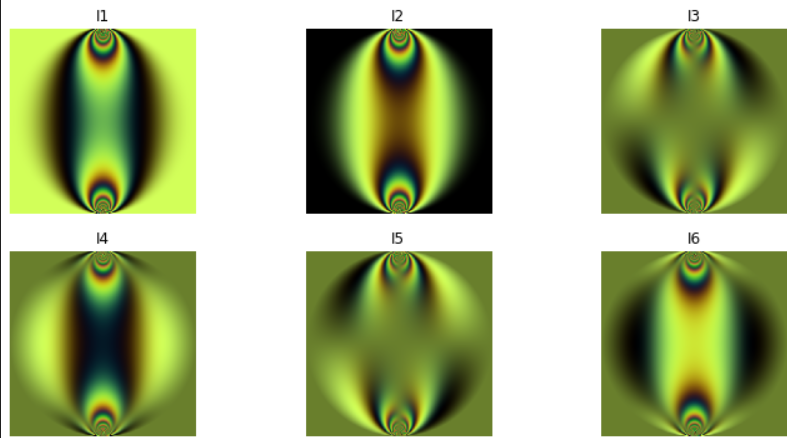
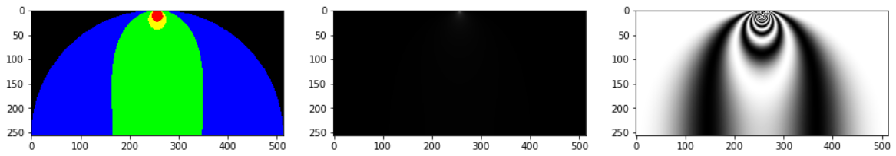

# 📄 Generación Sintética y Análisis de Imágenes Fotoelásticas  
Generación de imágenes fotoelásticas de forma sintética para su análisis, segmentación de zonas y evaluación de calidad. Incluye simulaciones y procesamiento de imágenes.

## 🚀 **¿Qué Hace?**
Permite crear imágenes simuladas basadas en ecuaciones de esfuerzos fotoelásticos, segmentarlas en zonas de interés y evaluar su calidad estructural. Ideal para estudios experimentales sin depender completamente de laboratorios físicos.

## 🧠 **Características Clave**
- Generación sintética de imágenes fotoelásticas a partir de modelos matemáticos.  
- Segmentación automática de zonas en las imágenes.  
- Evaluación de calidad mediante métricas de similitud estructural (SSIM).  

## 🧪 **Tecnologías Utilizadas**
- **Simulación y ecuaciones**: NumPy, Matplotlib (3D)  
- **Procesamiento de imágenes**: scikit-image, pandas  
- **Visualización de resultados**: Matplotlib  

---

## 📷 **Ejemplos de Resultados**
  

---

**Desarrollado por [Yeins Aristizabal](https://www.linkedin.com/in/yeins-aristizabal/)**  

🔗 [YouTube](https://www.youtube.com/@yeins-aristizabal-ai)
