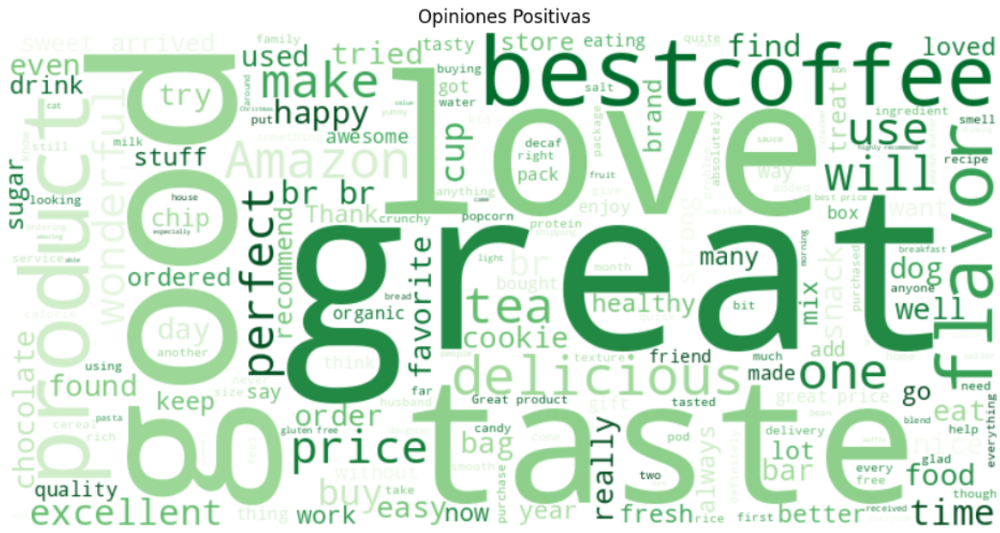
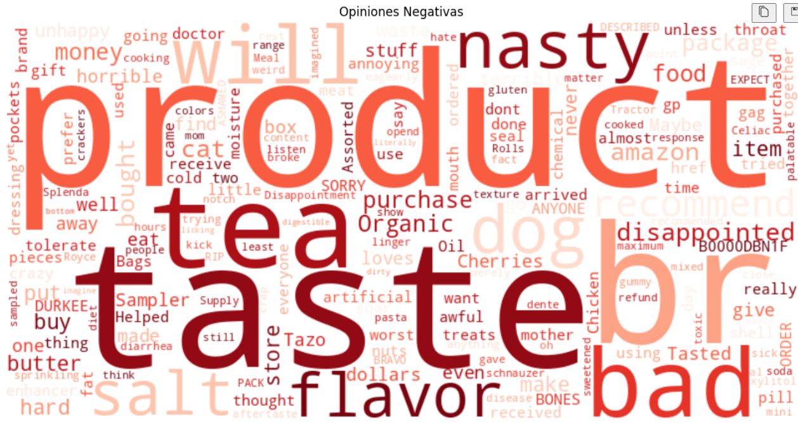
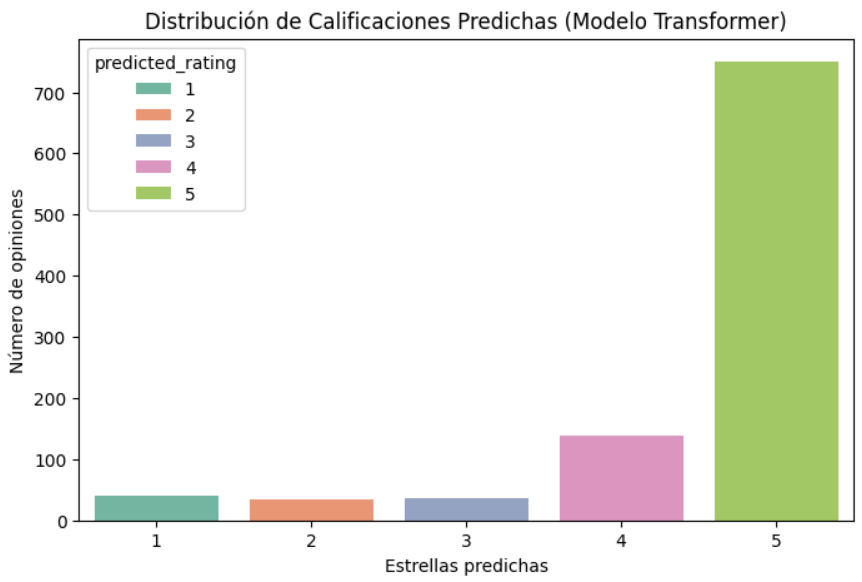

# 📄 Fundamentos y Práctica de Análisis de Sentimientos  
Una serie de notebooks para entender desde cero cómo preparar texto, analizar sentimientos y visualizar resultados de forma sencilla y práctica.

## 🚀 **¿Qué Hace?**
Explica los conceptos básicos del procesamiento de texto y del análisis de sentimientos con ejemplos guiados. Además, muestra cómo crear visualizaciones interactivas para interpretar mejor los resultados.

## 🧠 **Características Clave**
- Limpieza y preparación de texto paso a paso.  
- Análisis de sentimientos usando distintos enfoques.  
- Visualizaciones interactivas y nubes de palabras.  

## 🧪 **Tecnologías Utilizadas**
- **Procesamiento de texto**: NLTK, spaCy  
- **Análisis de sentimientos**: TextBlob, VaderSentiment, HugginFace Transformers
- **Visualizaciones**: Plotly, Dash, WordCloud, Matplotlib  
- **Traducción automática**: GoogleTranslator  

---

## 📷 **Ejemplos de Resultados**
  

---

**Desarrollado por [Yeins Aristizabal](https://www.linkedin.com/in/yeins-aristizabal/)**  

🔗 [YouTube](https://www.youtube.com/@yeins-aristizabal-ai)
